# TSA-Bench

A unified benchmark for evaluating the adversarial robustness of Time Series Foundation Models (TSFMs).

This repository is not just an attack implementation. It benchmarks both prediction robustness and internal representation robustness across multiple TSFMs using a shared interface, a shared attack pipeline, and a layer-wise Observer.

## Highlights

- Unified interface for multiple forecasting models
- Multiple adversarial attack methods
- Clean-vs-adversarial prediction evaluation on the original data scale
- Hidden representation analysis via an Observer
- Layer-wise divergence metrics for deeper diagnosis
- Optional Weights & Biases logging for batch-level and final summaries

## What This Benchmark Measures

The benchmark evaluates two complementary aspects:

- Prediction robustness
- Representation robustness

In practice, the pipeline compares clean and adversarial inputs, then uses the Observer to measure how internal hidden states diverge across layers.

```mermaid
flowchart LR
    Dataset[Dataset] --> Model[TSFM Wrapper]
    Dataset --> Attack[TSA / GWN Attack]
    Model --> Clean[Clean Prediction]
    Attack --> Adv[Adversarial Input]
    Clean --> Observer[Observer]
    Adv --> Observer
    Observer --> Metrics[Prediction + Layer-wise Metrics]
```



## Architecture

The main entry point is [src/main.py](src/main.py).

It loads the test dataset and fitted scaler, builds a forecasting model through the unified wrapper, prepares the attacker and the Observer, runs clean prediction and adversarial attack generation across the test set, inverse-transforms predictions back to the original scale, and reports prediction metrics together with layer-wise divergence metrics.

## Supported Models

The benchmark currently supports the following Time Series Foundation Models.

| Model | Paper | Code |
|-------|:-----:|:----:|
| PatchTST | [📄](https://arxiv.org/abs/2211.14730) | [💻](https://github.com/yuqinie98/PatchTST) |
| iTransformer | [📄](https://arxiv.org/abs/2310.06625) | [💻](https://github.com/thuml/iTransformer) |
| MOMENT | [📄](https://arxiv.org/abs/2402.03885) | [💻](https://github.com/moment-timeseries-foundation-model/moment) |
| LLMTime | [📄](https://arxiv.org/abs/2310.07820) | [💻](https://github.com/ngruver/llmtime) |

## Supported Attacks

| Attack | Notes |
| --- | --- |
| TSA | Temporally Sparse Attack |
| GWN | Gaussian white-noise attack |

## Target Layers

By default, the benchmark auto-selects monitoring layers from the loaded model.

If you want to monitor specific layers, pass them with `--target_layers` as a comma-separated list. Use `--show_model_architecture` in `src/main.py` to print the unified model structure first, then choose the exact layer names from that output.

You can also inspect the unified architecture directly from `src/main.py` with `--show_model_architecture` before choosing layers.

`--c_in` means the number of input channels, so it is the feature count of the time series. For example, a single-variable series uses `1`, and a multivariate series with 7 features uses `7`. The benchmark normally infers this from the dataset, but architecture-only inspection skips data loading, so `--c_in` must be provided in that mode.

Example:

```bash
python src/main.py \
  --data_path sample_data \
  --model_name PatchTST \
  --attack_method TSA \
  --c_in 7 \
  --show_model_architecture
```

After you choose the layer names, run:

```bash
python src/main.py \
  --data_path sample_data \
  --model_name PatchTST \
  --attack_method TSA \
  --target_layers model.backbone.encoder.layers.0.self_attn,model.backbone.encoder.layers.0.ff,model.head.linear
```

## Repository Layout

```text
requirements.txt      Python dependencies
docs/main.md          Detailed explanation of src/main.py
src/                  Main source code
src/main.py           Benchmark entry point
src/data.py           Dataset loading and scaling
src/model.py          Model wrapper loader
src/attacker.py       Attack and Observer logic
src/train_baseline.py  Training script for baseline weights
src/models/           Model implementations and wrappers
src/layers/           Shared model building blocks
sample_data/          Example NPY data files
scratch/              Temporary experiment files
weights/              Saved model weights created by training or linear probing
wandb/                Local Weights & Biases run files
```

## Installation

Clone the repository:

```bash
git clone https://github.com/xts777/TSA_attack.git
cd TSA_attack
```

Create a virtual environment:

```bash
python -m venv .venv
```

Activate the environment.

**Linux / macOS**

```bash
source .venv/bin/activate
```

**Windows (PowerShell)**

```powershell
.venv\Scripts\Activate.ps1
```

**Windows (Command Prompt)**

```cmd
.venv\Scripts\activate.bat
```

Install the required packages:

```bash
pip install -r requirements.txt
```

Verify the installation:

```bash
python src/main.py --help
```

## Data Format

The benchmark accepts either:

- a single CSV file containing numeric time-series columns
- a directory of NPY files, each file representing one time-series array

For CSV input, non-numeric columns are ignored automatically. For NPY input, 1D arrays are reshaped into `(length, 1)`.

The dataset is split internally into train, validation, and test segments with a 60/20/20 ratio.

## Quick Start

Start with a small smoke test if you only want to verify that the pipeline runs end to end.

### TSA attack

```bash
python src/main.py \
  --data_path sample_data \
  --model_name PatchTST \
  --attack_method TSA \
  --seq_len 24 \
  --pred_len 12 \
  --batch_size 1 \
  --max_batches 1 \
  --tau 3 \
  --epsilon 0.1
```

### GWN attack

```bash
python src/main.py \
  --data_path sample_data \
  --model_name PatchTST \
  --attack_method GWN \
  --seq_len 96 \
  --pred_len 48 \
  --batch_size 32
```

### Optional WandB logging

Add `--use_wandb` to log batch-level and final metrics to Weights & Biases.

```bash
python src/main.py \
  --data_path sample_data \
  --model_name PatchTST \
  --attack_method TSA \
  --use_wandb
```

## Output Folders

Runtime artifacts are written to these folders:

- `weights/`: saved model weights produced by automatic training or linear probing
- `wandb/`: local Weights & Biases run data when `--use_wandb` is enabled
- `scratch/`: temporary files for experiments or verification scripts

The benchmark also prints final results to the console, including:

- clean prediction MSE and MAE on the original data scale
- adversarial prediction MSE and MAE on the original data scale
- layer-wise Observer metrics such as divergence MSE, cosine distance, norm ratio, and L-infinity distance

## Training Baselines

If pretrained weights are not provided, `src/main.py` can train a baseline automatically depending on the selected model.

For MOMENT, the benchmark performs linear probing on the prediction head when needed.

You can also use [src/train_baseline.py](src/train_baseline.py) for a simple PatchTST training example.

## Notes

- `--max_batches` is useful for smoke tests because TSA can be expensive.
- `--seq_len` and `--pred_len` strongly affect runtime and memory usage.
- The benchmark computes final error metrics after inverse-transforming predictions back to the original scale.
- The Observer is designed to expose layer-wise representation shifts, not just output degradation.
