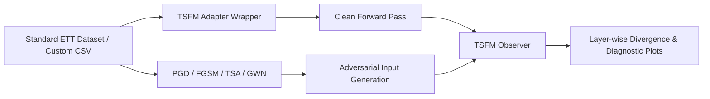

# TSA-Bench

A unified benchmark for evaluating the adversarial robustness of Time Series Foundation Models (TSFMs).

This repository benchmarks both prediction robustness and internal representation robustness across multiple TSFMs using a shared adapter interface, a unified attack pipeline, and a layer-wise Observer.

---

## Highlights

- **Unified Adapter Interface for TSFMs**: Support for PatchTST, iTransformer, MOMENT, and LLMTime.
- **Flexible Layer Exploration (`--max_depth`)**: Relative depth filtering to isolate component-level blocks (e.g., Transformer blocks) or specific layer tiers.
- **Chronological Execution Order**: Observer plots strictly follow the physical forward-pass execution flow ($Input \to Embedding \to Encoder Blocks \to Projection/Head \to Output$).
- **White-Box & Black-Box Attack Suite**: FGSM, PGD, TSA, and GWN (Gaussian White Noise).
- **Dual-Aspect Robustness Diagnostics**: Measures both prediction degradation on the original scale and hidden representation divergence.

---

## What This Benchmark Measures

The benchmark evaluates two complementary robustness metrics:

1. **Prediction Robustness**: Evaluation of clean vs. adversarial prediction degradation (MSE, MAE, Degradation Ratio) inverse-scaled to original data units.
2. **Representation Robustness**: Layer-wise tracking of internal hidden state shifts (MSE divergence, Cosine Distance, Norm Ratio) via PyTorch forward hooks.



---

## 📚 Supported Models & Papers

| Model | Official Paper | Code Source |
| --- | --- | --- |
| **PatchTST** | [ICLR 2023 Paper](https://arxiv.org/abs/2211.14730) | [yuqinie98/PatchTST](https://github.com/yuqinie98/PatchTST) / [`src/models/PatchTST.py`](src/models/PatchTST.py) |
| **iTransformer** | [ICLR 2024 Paper](https://arxiv.org/abs/2310.06625) | [thuml/iTransformer](https://github.com/thuml/iTransformer) / [`src/models/iTransformer.py`](src/models/iTransformer.py) |
| **MOMENT** | [ICML 2024 Paper](https://arxiv.org/abs/2402.03885) | [AutonLab/MOMENT](https://github.com/AutonLab/MOMENT) / [`momentfm`](https://huggingface.co/AutonLab/MOMENT-1-large) |
| **LLMTime** | [NeurIPS 2023 Paper](https://arxiv.org/abs/2310.07820) | [maragkos/LLMTime](https://github.com/maragkos/LLMTime) / [`src/models/LLMTime.py`](src/models/LLMTime.py) |

---

## 🛡️ Supported Attacks & References

| Attack | Type | Reference Paper | Code Source |
| --- | --- | --- | --- |
| **TSA** | Black-box | [ICLR 2025 Paper](https://openreview.net/pdf?id=oL806RzbDi) | [`TSAttacker` in `src/attacker.py`](src/attacker.py) |
| **PGD** | White-box | [ICLR 2018 Paper](https://arxiv.org/abs/1706.06083) | [`PGDAttacker` in `src/attacker.py`](src/attacker.py) |
| **FGSM** | White-box | [ICLR 2015 Paper](https://arxiv.org/abs/1412.6572) | [`FGSMAttacker` in `src/attacker.py`](src/attacker.py) |
| **GWN** | Baseline |  Noise Baseline | [`GWNAttacker` in `src/attacker.py`](src/attacker.py) |

---

## 📊 Standard Benchmark Datasets

Pass `--dataset` to automatically download, split, and standardize standard benchmark datasets:

* **`ETTh1`**: Electricity Transformer Temperature (Hourly 1)
* **`ETTh2`**: Electricity Transformer Temperature (Hourly 2)
* **`ETTm1`**: Electricity Transformer Temperature (15-min 1)
* **`ETTm2`**: Electricity Transformer Temperature (15-min 2)

---

## 🔍 Layer-Wise Observer & `--max_depth` Control

By default, the Observer automatically inspects and selects key target layers across the model architecture.

### Relative Depth Filtering (`--max_depth`)

You can control the granularity of monitored layers via `--max_depth N`:
- `--max_depth 2`: Monitors top-level component blocks (e.g. `patch_embedding`, `encoder.block.0` ~ `encoder.block.N`, `head.linear`).
- `--max_depth 3`: Monitors sub-component layers while filtering out deeper leaf nodes.
- **ModuleList Indexing**: Numerical indices (e.g. `block.0`, `block.1`) are normalized to represent their parent Transformer Block depth.

### Layer Exploration via `--show_model_architecture`

To inspect the full layer hierarchy before running an attack:

```bash
python src/main.py \
  --dataset ETTh1 \
  --model_name PatchTST \
  --c_in 7 \
  --show_model_architecture
```

To monitor custom target layers, pass `--target_layers`:

```bash
python src/main.py \
  --dataset ETTh1 \
  --model_name PatchTST \
  --attack_method PGD \
  --target_layers enc_embedding.value_embedding,encoder.attn_layers.0,projection
```

---

## 🚀 Installation & Environment Setup

1. **Clone the repository**:
   ```bash
   git clone https://github.com/xts777/TSA_Bench.git
   cd TSA_Bench
   ```

2. **Create virtual environment (`venv`)**:
   ```bash
   python -m venv .venv
   ```

3. **Activate environment**:
   * **Linux / macOS**:
     ```bash
     source .venv/bin/activate
     ```
   * **Windows (PowerShell)**:
     ```powershell
     .venv\Scripts\Activate.ps1
     ```
   * **Windows (Command Prompt)**:
     ```cmd
     .venv\Scripts\activate.bat
     ```

4. **Install dependencies**:
   ```bash
   pip install -r requirements.txt
   ```

---

## 💡 Quick Start Examples

### 1. Benchmark on Standard Dataset (`ETTh1`) with PatchTST

```bash
python src/main.py \
  --dataset ETTh1 \
  --model_name PatchTST \
  --attack_method PGD \
  --epsilon 0.15 \
  --max_depth 3 \
  --plot_results
```

### 2. Evaluate MOMENT Foundation Model with Depth Filtering

```bash
python src/main.py \
  --dataset ETTh1 \
  --model_name MOMENT \
  --attack_method PGD \
  --epsilon 0.15 \
  --seq_len 96 \
  --pred_len 48 \
  --max_depth 2 \
  --plot_results
```

### 3. Evaluate iTransformer with White-Box PGD

```bash
python src/main.py \
  --dataset ETTh2 \
  --model_name iTransformer \
  --attack_method PGD \
  --epsilon 0.1 \
  --max_depth 3 \
  --plot_results
```

### 4. Custom CSV / Data Directory Input

```bash
python src/main.py \
  --data_path path/to/custom_data.csv \
  --model_name PatchTST \
  --attack_method TSA \
  --plot_results
```

---

## 📂 Repository Layout

```text
TSA_Bench/
├── src/
│   ├── main.py           # Main benchmark entry point
│   ├── data.py           # Dataset auto-downloader, standardizer, and DataLoader
│   ├── model.py          # Unified model wrapper loader (PatchTST, iTransformer, MOMENT, LLMTime)
│   ├── attacker.py       # Attack algorithms (TSA, PGD, FGSM, GWN) & TSFMObserver
│   ├── visualizer.py     # Diagnostic plot generator
│   └── models/           # Official model architecture implementations
├── data/                 # Auto-downloaded and cached benchmark datasets (.csv)
├── weights/              # Saved model weights created by training or linear probing
├── results/plots/        # Generated diagnostic plot artifacts (.png)
└── requirements.txt      # Dependencies
```

---

## 📈 Output Metrics & Artifacts

After execution, the benchmark outputs:
1. **Console Summary**:
   * Clean MSE / MAE (on original data scale)
   * Adversarial MSE / MAE (on original data scale)
   * Prediction Degradation Ratio ($\text{MSE}_{\text{adv}} / \text{MSE}_{\text{clean}}$)
2. **Diagnostic Plots (`results/plots/`)**:
   * `*_ts_comparison.png`: Clean vs. Adversarial vs. Ground Truth time-series prediction overlay.
   * `*_layer_divergence.png`: 3-panel Observer plot showing Representation MSE, Cosine Distance, and Norm Ratio across execution-ordered layers.

